  

<!-- 🎬 HERO — video intro + name (Boy walks in & waves hi) -->

<!-- ⚡ LEFT: what I build (ETL, APIs, Microservices) • 🏃 RIGHT: life outside code (ML, Data, Fitness) -->

<!-- ⚛️ TECH STACK ORBIT -->

<!-- 🪪 DEVELOPER ID + DASHBOARD -->

<!-- 💌 LET'S CONNECT -->

 

    
    
    
    
    
    
    
  

   

  <!-- GitHub Stats -->
  

    
    &nbsp;
    
    &nbsp;
    
  

